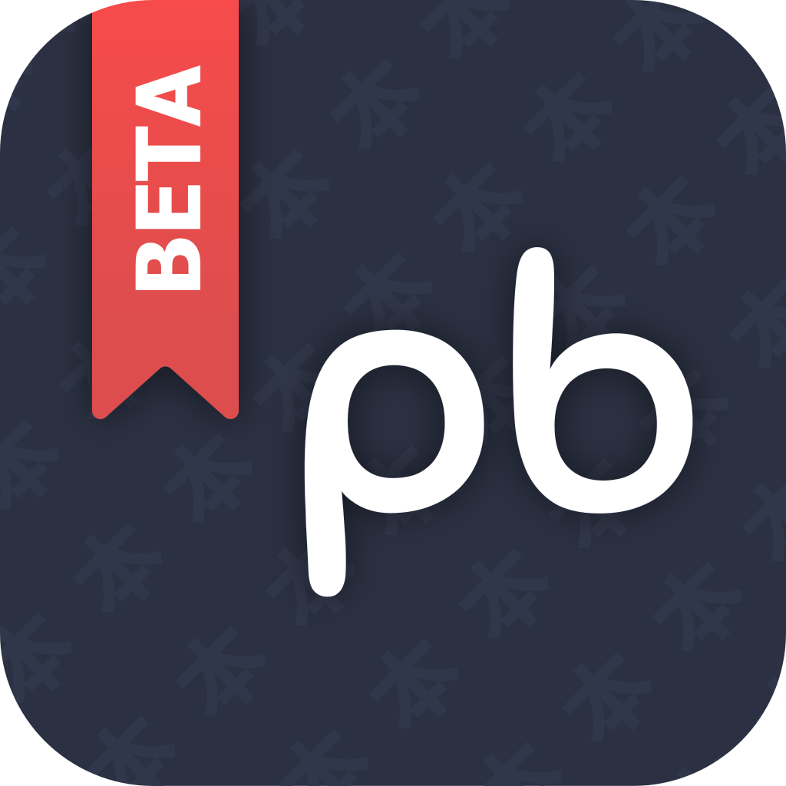

	
	<h1>Paperback Website</h1>
	

## App Repository

	

## Contributing

Pull requests are welcome. For major changes, please open an issue first to discuss what you would like to change.

-   [Code of Conduct](./CODE_OF_CONDUCT.md)
-   [Contributing guide](./CONTRIBUTING.md)
-   [Discord server](https://discord.paperback.moe)

## Credits

Thank you to all the people who have already contributed!

